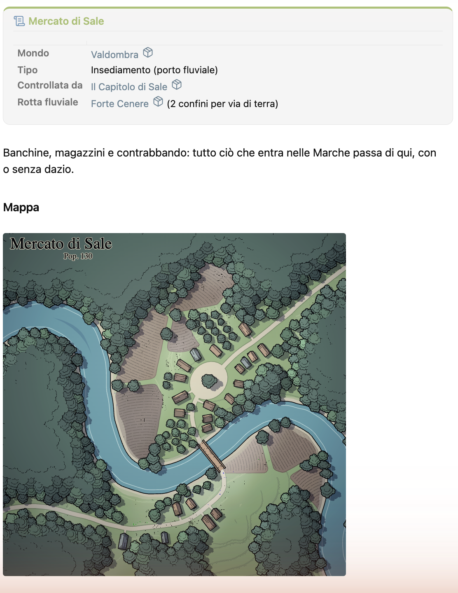
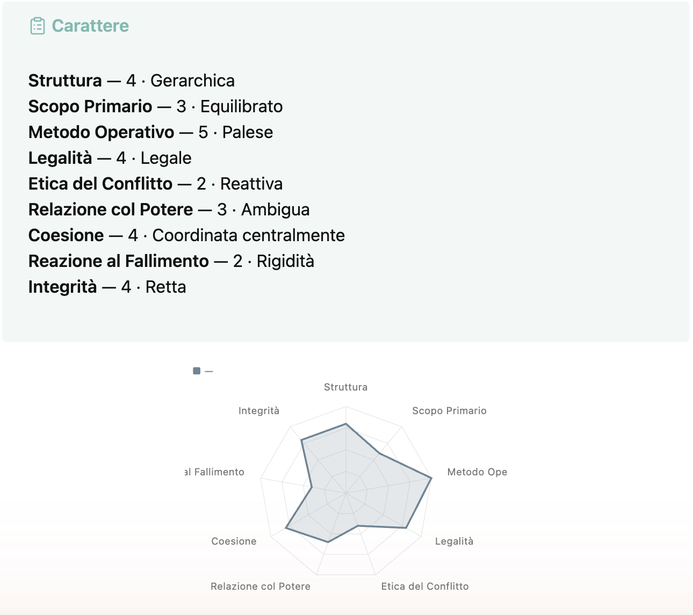
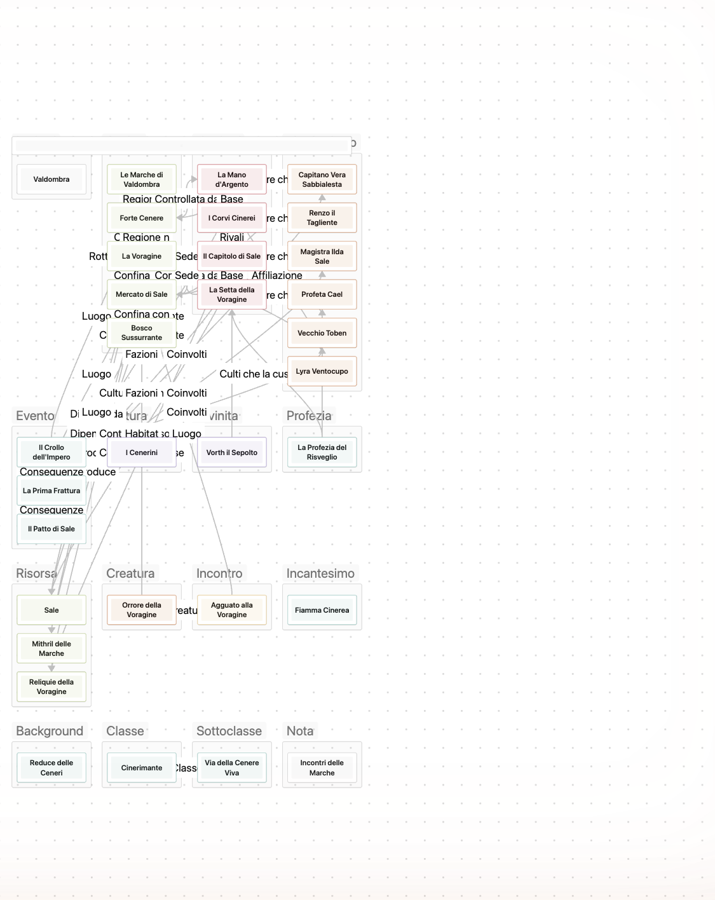
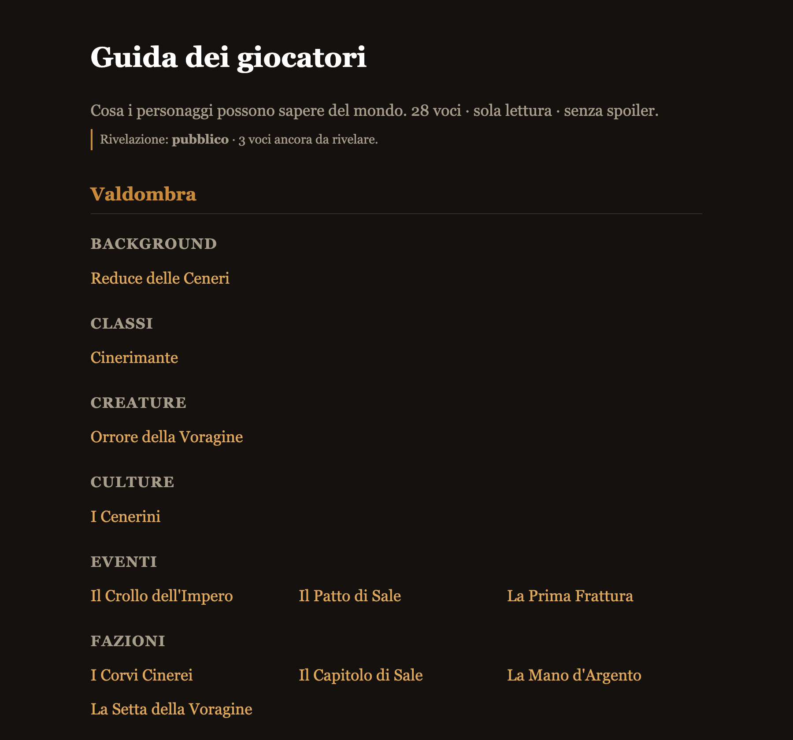

# GDR — vault Obsidian generato

Repo di **sviluppo** del vault GDR: worldbuilding profondo *connesso* al tavolo
D&D 5.5e. Il differenziatore: ogni nota lore espone una **superficie giocabile**
(`uso_al_tavolo`, `gancio`, `pressione`, `prossima_mossa`).

Le **sorgenti** in `Dev/` sono l'unica verità; il vault Obsidian è un **artefatto
ricostruibile** generato in `dist/GDR-vault/` (gitignorato).

## Per i Game Master — usarlo (niente sviluppo)

Scarica l'ultimo **vault pronto** dalle [Releases](../../releases) (`GDR-vault-v*.zip`),
scompattalo e in Obsidian fai **«Apri cartella come vault»** (i plugin sono inclusi). Dentro:

- un **mondo-esempio** giocabile (*Valdombra*) e la nota **«Inizia da qui»** che in 3 passi
  mostra il cuore del sistema: la lore accende la **superficie giocabile**;
- worldbuilding profondo *connesso* al tavolo **D&D 5.5e** — schede PG, statblock, incontri
  (budget 2024), condizioni, dadi — **locale e gratis**, i tuoi dati restano tuoi;
- un **sito dei giocatori** statico e *senza spoiler* che generi tu (`npm run site`), con
  **rivelazione progressiva**: sveli il mondo man mano che la campagna procede.

Cancella la cartella `_Esempio — Valdombra` per partire da un foglio bianco. La guida completa
è nel **LEGGIMI** dentro il vault.

## Screenshot

|  |  |
|---|---|
|  |  |
| *Una nota lore: infobox, prosa e mappa.* | *Il radar del Carattere dal grafo.* |
|  |  |
| *Il mondo a colpo d'occhio (Canvas).* | *Il sito dei giocatori, senza spoiler.* |

---

> Il resto di questo README è per chi vuole **costruire da sorgente** o contribuire.

## Come funziona

```
Dev/Source/{YAML,Jinja,JS}  ──►  Dev/Tools/render.py  ──►  dist/GDR-vault/
   modello   template  runtime          generatore            vault vivo
```

- `render.py` è un **orchestratore sottile** (modello+IO in `common.py`, SRD in
  `build_srd.py`, rules-engine PG in `build_personaggio.py`, validazione in
  `validate.py`). Fonde `core.yaml` + `system.yaml` + `entities/*.yaml` in un unico
  modello, rende i template **Jinja → Markdown**, copia i **JS** runtime e fa un
  **merge non distruttivo** della config `.obsidian` (non tocca `Mondi/` né i plugin).
- I JS sono **autonomi** (niente bundling): leggono i dati a runtime da
  `z.automazioni/data/*.json` via `app.vault.adapter.read`.
- Ogni entità tende alla **trinità**: YAML (schema) + Jinja (corpo via macro) + JS
  (`crea_<id>.js`, il wizard che applica le regole e stampa il **frontmatter**). Il
  template chiama solo `tp.user.crea_<id>` in alto; il corpo lo rende Jinja con Meta
  Bind (`INPUT`/`VIEW`) e Dataview.

## Comandi

| Comando | Effetto |
|---|---|
| `npm run check` | Valida YAML/Jinja e `node --check` sui JS. **Non scrive.** |
| `npm run build` | Genera il vault in `dist/GDR-vault/` (non distruttivo). |
| `npm run site` | Genera il **sito dei giocatori** (statico, spoiler-free) in `dist/GDR-site/`. |
| `npm run dist` | Confeziona gli **zip di release** (vault turnkey + sito) in `dist/`. Vedi [releasing](docs/releasing.md). |
| `npm run clean` | Rimuove solo gli artefatti generati (mai `.obsidian`/contenuti). |

Verifica sempre con `npm run check` o un render standalone a stdout; il `build`
scrive sul vault Obsidian reale.

### Sito dei giocatori (`npm run site`)

Esporta da `dist/GDR-vault/Mondi/` un **sito statico HTML** navigabile, pensato per i
**giocatori**: una voce per nota di worldbuilding (fatti, prosa, relazioni linkate),
**senza spoiler** e **read-only**. Aggira il limite di Obsidian Publish (che non rende
i plugin dinamici Dataview/Meta Bind/JS Engine): qui Dataview/Meta Bind/Templater/
js-engine, i callout `segreto` e i campi del DM (`uso_al_tavolo`/`gancio`/`pressione`/
`prossima_mossa`/`conseguenza`) sono **rimossi a monte**. Output in `dist/GDR-site/`
(`index.html` + una pagina per nota + `site.css`): aprilo in locale o pubblica la
cartella su GitHub Pages/Netlify. Per **nascondere** una nota intera ai giocatori:
`visibilita: dm` (o `pubblico: false`) nel frontmatter. Implementazione in
[`Dev/Tools/build_site.py`](Dev/Tools/build_site.py), template in `Dev/Source/SiteJinja/`.

## Documentazione

Approfondimenti in [`docs/`](docs/): [architecture](docs/architecture.md) ·
[data_model](docs/data_model.md) · [plugin_contracts](docs/plugin_contracts.md) ·
[rules_layer](docs/rules_layer.md) · [play_layer](docs/play_layer.md) ·
[releasing](docs/releasing.md) · **[roadmap & analisi](docs/roadmap.md)**.

## Struttura

```
Dev/Source/YAML/      core.yaml · system.yaml · entities/*.yaml · pg_rules.yaml
                      plugins.yaml · templates.yaml · pages.yaml
Dev/Source/Jinja/     _macros.j2 · _entity_base.j2 + un template per entità
Dev/Source/SiteJinja/ page.html.j2 · index.html.j2 · site.css (sito dei giocatori)
Dev/Source/JS/        create_entity.js · crea_pg.js/sali_pg.js · meta_actions.js · views.js
                      genera.js · boot.mjs (ESM) · _comparators.js/_homebrew_bridge.js (sorgenti canoniche)
Dev/Source/SRD/       JSON SRD 5.2.1 IT · statblocks/ layout Fantasy Statblocks
Dev/Tools/            common.py · build_srd.py · build_personaggio.py · build_site.py · validate.py · render.py
Dev/Reference/        cheat-sheet sintassi dei plugin installati
docs/                 architecture · data_model · rules_layer · play_layer · plugin_contracts · roadmap
```

## Il modello (YAML)

`render.load_core()` fonde tre file in un unico modello (vedi
[data_model](docs/data_model.md)):

- **`core.yaml`** — globali worldbuilding: `fields` (registro centrale), `tavolo`
  (superficie giocabile), `states`.
- **`system.yaml`** — globali 5.5e: `fields` di sistema, `statblock`,
  `caratteristiche` (6), `abilita` (18).
- **`entities/<id>.yaml`** — schema **per-entità**: `folder`, `order`, `templates`,
  `subtypes`, `fields`, `scheda`, `assi`, `relazioni`, `creation` (wizard).

**`pg_rules.yaml`** — overlay del rules-engine PG (generazione caratteristiche).
**`plugins.yaml`** — plugin + `metabind_inputs` + bottoni-azione.
**`templates.yaml`** — solo le `actions` (i template di creazione sono nei file-entità).
**`pages.yaml`** — pagine-indice per dominio → `index.md.j2`.

## Jinja

`_macros.j2` raccoglie i **componenti condivisi (DRY)**: `identita_card`, `tavolo`,
`carattere`, `relazioni`, `collegamenti`, `vista`, `scheda`, `scheda_pg`/
`scheda_pg_rules`, e gli helper Meta Bind `field`/`view`/`computed`/`compute_into`.
`_entity_base.j2` è lo **scheletro** (header + tab) che ogni template per-entità
estende (``/``); le pagine `home`/`index`/
`leggimi` sono generate a parte.

## Aggiungere roba

- **Campo editabile**: voce in `core.fields` (o `entities/<id>.fields`) → usalo con
  `field('id')`; se il widget non è `text`/`number`, dichiaralo in `plugins.yaml:metabind_inputs`.
- **Entità**: *prima* applica il [principio di inclusione](docs/data_model.md#principio-di-inclusione--cosa-diventa-unentità)
  (relazioni proprie **e** superficie giocabile propria — altrimenti è campo/subtype/tag).
  Se è davvero un'entità: un file `entities/<id>.yaml` (`folder`/`order`/`templates`/`subtypes` +
  opz. `fields`/`scheda`/`assi`/`relazioni`/`creation`) + il template `Jinja/<id>.md.j2`.
- **Pagina-indice**: voce in `pages.yaml` (file/title/category/columns/sort).

`check()` (`npm run check`) valida confine core/system, dup-ID, snake_case, shape,
schema dei file-entità e i riferimenti Jinja: un refuso si ferma prima del build.

## Requisiti

- **Python 3** + `pip install -r requirements-dev.txt` (Jinja2, PyYAML).
- **Node** (per `node --check` dentro `npm run check`).

## Licenza

- **Codice, template e tooling**: [MIT](LICENSE).
- **Contenuto SRD** (`Dev/Source/SRD/`): *System Reference Document 5.2.1* di Wizards of the
  Coast LLC, sotto [CC-BY-4.0](https://creativecommons.org/licenses/by/4.0/) — vedi
  [`Dev/Source/SRD/LICENSE_SRD`](Dev/Source/SRD/LICENSE_SRD) per la dichiarazione di attribuzione.

> Quest'opera include materiale tratto dal System Reference Document 5.2.1 («SRD 5.2.1») di
> Wizards of the Coast LLC (https://www.dndbeyond.com/srd), concesso in licenza CC-BY-4.0. È
> «compatibile con la quinta edizione» (5E). Non affiliata né approvata da Wizards of the Coast.
