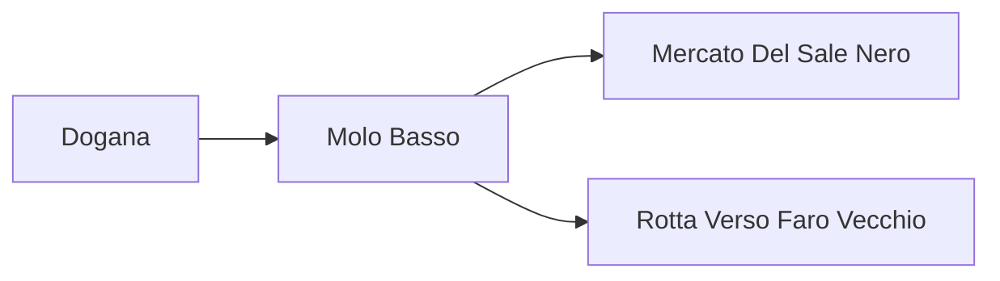

# Mappa Pubblica Di Brumafonda

Mappa testuale player-safe per la demo. In Obsidian puo essere sostituita da un canvas o Excalidraw mantenendo gli stessi campi.

```mermaid
flowchart LR
  A["Dogana"] --> B["Molo Basso"]
  B --> C["Mercato Del Sale Nero"]
  B --> D["Rotta Verso Faro Vecchio"]
```
